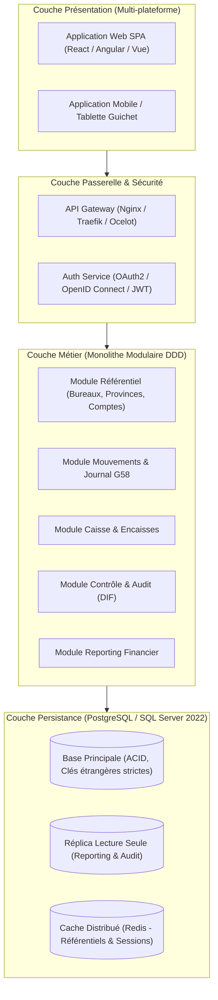

# Cahier des Charges - ComptaGe (Système de Gestion Comptable de Paositra Malagasy)

---

## 1. Présentation Générale & Vision

### 1.1 Contexte et But du Projet
Le projet **ComptaGe** (abréviation de *Comptabilité Générale*) est une application d'entreprise dédiée à la gestion comptable, financière et logistique des bureaux de poste du réseau national de **Paositra Malagasy** (la société nationale des postes et des services financiers postaux de Madagascar).

L'application a pour objectif principal d'assurer :
1. **La centralisation et le suivi des opérations comptables quotidiennes (Journal G58)** : enregistrement de tous les flux financiers (débits, crédits, encaissements, décaissements) générés par les services postaux, les mandats, les timbres et la trésorerie.
2. **Le suivi des périodes de gestion des receveurs des postes** : inventaire de début et de fin d'exercice/période (numéraire, valeurs postales, timbres fiscaux, soldes de départ et coupures de gestion).
3. **Le contrôle des mouvements d'encaisse et de coffre-fort** : gestion en temps réel des espèces physiques, des créances et des stocks finals.
4. **L'audit, le redressement et le contrôle financier** : identification immédiate des anomalies de caisse grâce à la comparaison des montants déclarés et des montants rectifiés par les inspecteurs/comptables vérificateurs.
5. **Le maillage territorial postal** : gestion hiérarchique des provinces (*Faritany*), des bureaux de poste (*NCODIQUE*), de leurs classes et de leurs rattachements aux centres financiers régionaux.

### 1.2 Grands Modules Identifiés
* **Module 1 : Référentiel Postal & Territorial** : cartographie des provinces, codification codique des bureaux de poste, classification hiérarchique et centres financiers de rattachement.
* **Module 2 : Plan Comptable & Nomenclature des Produits** : arborescence des comptes (débit, crédit, encaisse), nomenclature des services postaux (mandats express, IFS, valeurs postales, timbres, télégraphie, dépenses/recettes budgétaires).
* **Module 3 : Gestion des Exercices & Responsabilités des Receveurs** : ouverture, suivi et coupure de gestion d'un receveur par bureau de poste, avec contrôle des réserves en numéraire et valeurs.
* **Module 4 : Registre Quotidien des Mouvements (Journal G58)** : saisie détaillée des opérations postales par date, bureau, catégorie et sens (débit/crédit).
* **Module 5 : Mouvements & Contrôle des Encaisses** : suivi physique de la trésorerie, des stocks de timbres et des créances.
* **Module 6 : Audit, Redressement & Détection des Écarts** : détection automatique des discordances de montants (`Montant <> MontantRectif`) et formalisation des motifs de redressement.
* **Module 7 : Administration, Sécurité (RBAC) & Personnalisation** : authentification des utilisateurs, attribution fine des modules fonctionnels et personnalisation ergonomique de l'interface utilisateur.

---

## 2. Dictionnaire de Données Fonctionnel

### Table : Products
*Référentiel des produits, prestations et services postaux commercialisés ou gérés par la poste (ex. valeurs postales, mandats émis en numéraire, IFS, objets en consignation).*

| Champ | Type SQL | Rôle Fonctionnel | Obligatoire (Oui/Non) | Contraintes / Règles métiers |
| :--- | :--- | :--- | :--- | :--- |
| `ProductID` | `int` | Identifiant unique du produit postal | Oui | Clé primaire (`PK_Products`), Auto-incrémenté (`IDENTITY(1,1)`). |
| `ProductName` | `nvarchar(40)` | Désignation officielle du produit ou service | Oui | Obligatoire (`NOT NULL`). Longueur maximale 40 caractères. |
| `CategoryID` | `int` | Identifiant de la catégorie de rattachement | Oui | Obligatoire (`NOT NULL`). Référence logique vers `Categories(CategoryID)`. |

---

### Table : Categories
*Classification macroscopique des opérations et produits comptables (ex. Objets reçus, Recette de trésorerie, Mouvements de fonds, Dépenses budgétaires).*

| Champ | Type SQL | Rôle Fonctionnel | Obligatoire (Oui/Non) | Contraintes / Règles métiers |
| :--- | :--- | :--- | :--- | :--- |
| `CategoryID` | `int` | Identifiant unique de la catégorie | Oui | Clé primaire (`PK_Categories`), Auto-incrémenté (`IDENTITY(1,1)`). |
| `idType` | `int` | Type/Classe de rattachement (ex. Débit ou Crédit) | Oui | Obligatoire (`NOT NULL`). Référence logique vers `tblClasse(idType)`. |
| `CategoryName` | `nvarchar(50)` | Libellé de la catégorie | Oui | Obligatoire (`NOT NULL`). Longueur max 50 caractères. |
| `Description` | `ntext` | Description détaillée de la catégorie | Non | Facultatif (`NULL`). Texte long. |
| `Picture` | `image` | Icône ou illustration visuelle pour l'interface | Non | Facultatif (`NULL`). Donnée binaire (BLOB). |

---

### Table : Arborescence
*Structure hiérarchique des modules, menus et sous-menus de l'application cliente pour la navigation et l'attribution des droits.*

| Champ | Type SQL | Rôle Fonctionnel | Obligatoire (Oui/Non) | Contraintes / Règles métiers |
| :--- | :--- | :--- | :--- | :--- |
| `CodeModule` | `smallint` | Identifiant technique du module applicatif | Non | Entier court (`NULL`). Identifie de manière unique le nœud applicatif. |
| `Nom` | `nvarchar(50)` | Nom technique du composant IHM (ex: `SaisieToolStripMenuItem`) | Non | Facultatif (`NULL`). Clé technique de liaison avec l'IHM. |
| `CodeParent` | `smallint` | Référence au module parent dans l'arborescence | Non | Clé d'arborescence (`NULL`). `0` pour les nœuds racines. |
| `CodeSuivant` | `smallint` | Ordre d'affichage ou nœud fraternel suivant | Non | Utilisé pour le tri et l'enchaînement de navigation. |
| `Libelle` | `nvarchar(50)` | Libellé textuel affiché à l'utilisateur dans le menu | Non | Texte convivial affiché dans les menus (ex: `G58 DEBIT/CREDIT`). |

---

### Table : UserTable
*Comptes des utilisateurs du système, profils d'accès et paramètres de personnalisation graphique de leur interface utilisateur.*

| Champ | Type SQL | Rôle Fonctionnel | Obligatoire (Oui/Non) | Contraintes / Règles métiers |
| :--- | :--- | :--- | :--- | :--- |
| `AccesName` | `nvarchar(15)` | Identifiant de connexion (login) | Oui | Clé d'identification métier (`NOT NULL`). Longueur max 15 caractères. |
| `Nom` | `nvarchar(50)` | Nom et prénom de l'agent | Non | Facultatif (`NULL`). |
| `Fonction` | `nvarchar(20)` | Rôle métier ou poste de l'agent (ex: `adm`, `comptable`) | Non | Facultatif (`NULL`). Rôle applicatif. |
| `MotPasse` | `nvarchar(100)` | Mot de passe de connexion | Non | Stocké sous format obfusqué / hashé hérité (`NULL`). |
| `SystFonc` | `nvarchar(2)` | Code de niveau système ou groupe de privilèges | Non | Indicateur de privilèges système (ex: `00`, `01`). |
| `Background` | `int` | Couleur d'arrière-plan de l'IHM | Non | Code couleur numérique ARGB / WinForms. |
| `Bicolor` | `bit` | Activation du mode bicolore | Non | Booléen (0 ou 1). |
| `Color2` | `int` | Deuxième couleur pour dégradé IHM | Non | Code couleur numérique. |
| `Inverse` | `bit` | Inversion des couleurs IHM | Non | Booléen (0 ou 1). |
| `Sens` | `tinyint` | Orientation du dégradé graphique | Non | Entier court (0-255). |
| `TypeDegrade` | `tinyint` | Type d'effet de dégradé visuel | Non | Entier court (0-255). |
| `Rouge` | `bit` | Composante couleur Rouge active | Non | Booléen (0 ou 1). |
| `Vert` | `bit` | Composante couleur Verte active | Non | Booléen (0 ou 1). |
| `Bleu` | `bit` | Composante couleur Bleue active | Non | Booléen (0 ou 1). |
| `Relief` | `bit` | Activation de l'effet de relief sur les contrôles | Non | Booléen (0 ou 1). |
| `ClairFonce` | `bit` | Mode clair ou sombre | Non | Booléen (0 ou 1). |
| `Vertical` | `bit` | Orientation verticale de la palette graphique | Non | Booléen (0 ou 1). |
| `Horizontal` | `bit` | Orientation horizontale de la palette graphique | Non | Booléen (0 ou 1). |
| `FondTab` | `int` | Couleur de fond des onglets / tableaux | Non | Code couleur numérique. |

---

### Table : UserModule
*Table de liaison définissant les autorisations d'accès des utilisateurs aux modules de l'application (modèle RBAC).*

| Champ | Type SQL | Rôle Fonctionnel | Obligatoire (Oui/Non) | Contraintes / Règles métiers |
| :--- | :--- | :--- | :--- | :--- |
| `CompteUser` | `nvarchar(15)` | Login de l'utilisateur concerné | Non | Référence logique vers `UserTable(AccesName)`. |
| `CodeModule` | `tinyint` | Code du module autorisé | Non | Référence logique vers `Arborescence(CodeModule)`. |
| `NomModule` | `nvarchar(100)` | Nom technique ou libellé du module attribué | Non | Libellé du composant/menu auquel l'agent a accès. |

---

### Table : TblProvince
*Référentiel des provinces administratives de Madagascar (Faritany).*

| Champ | Type SQL | Rôle Fonctionnel | Obligatoire (Oui/Non) | Contraintes / Règles métiers |
| :--- | :--- | :--- | :--- | :--- |
| `Nprovince` | `int` | Numéro d'ordre de la province (1 à 6) | Non | Identifiant de province (ex: 1=Antananarivo, 2=Antsiranana...). |
| `Nom` | `nvarchar(50)` | Nom officiel de la province | Non | Nom de la région administrative. |

---

### Table : TblBureau
*Référentiel des bureaux de poste de la Paositra Malagasy et de leurs caractéristiques administratives et financières.*

| Champ | Type SQL | Rôle Fonctionnel | Obligatoire (Oui/Non) | Contraintes / Règles métiers |
| :--- | :--- | :--- | :--- | :--- |
| `NFaritany` | `int` | Identifiant de la province de rattachement | Non | Référence logique vers `TblProvince(Nprovince)`. |
| `Nbur` | `int` | Numéro d'ordre du bureau au sein de la province | Non | Identifiant local séquentiel. |
| `codeclasse` | `int` | Code numérique de la classe du bureau | Non | Catégorie administrative du bureau. |
| `NCODIQUE` | `int` | Code codique officiel postal du bureau (identifiant unique métier) | Non | Clé métier fondamentale de la Poste (ex: 50316, 30214). |
| `Nombureau` | `nvarchar(50)` | Dénomination géographique du bureau de poste | Non | Nom de la localité / agence postale (ex: *Ambatosoratra*). |
| `Classe` | `nvarchar(50)` | Classification hiérarchique postale | Non | Classement postal réglementaire (ex: `R1`, `R2`, `R5`, `HC`). |
| `CCP` | `nvarchar(10)` | Numéro du compte chèque postal du bureau | Non | Référence du compte de fonds de roulement postal. |
| `NCF` | `int` | Numéro du Centre Financier de tutelle | Non | Rattachement financier. |
| `CF_Codik` | `int` | Code codique du Centre Financier de rattachement | Non | Code postal du bureau comptable centralisateur. |

---

### Table : tblGestionBur
*Historique des périodes d'exercice et de responsabilité des receveurs à la tête d'un bureau de poste, avec arrêté des valeurs en caisse.*

| Champ | Type SQL | Rôle Fonctionnel | Obligatoire (Oui/Non) | Contraintes / Règles métiers |
| :--- | :--- | :--- | :--- | :--- |
| `idGestion` | `int` | Identifiant unique de la période de gestion | Oui | Clé primaire (`PK_tblGestionBur`), Auto-incrémenté (`IDENTITY(1,1)`). |
| `ncodique` | `int` | Code codique du bureau de poste géré | Oui | Obligatoire (`NOT NULL`). Référence logique vers `TblBureau(NCODIQUE)`. |
| `dateDebGest` | `datetime` | Date de prise de fonction / début de gestion | Oui | Obligatoire (`NOT NULL`). Début de la période comptable. |
| `datefinGest` | `datetime` | Date de cessation / fin de gestion | Oui | Obligatoire (`NOT NULL`). Doit être >= `dateDebGest`. |
| `Nomrec` | `nvarchar(50)` | Nom officiel du receveur responsable | Oui | Obligatoire (`NOT NULL`). Identité de l'agent comptable assermenté. |
| `reservenum` | `float` | Réserve en numéraire (espèces en coffre) au départ | Non | Montant monétaire d'encaisse initiale. |
| `valPost` | `float` | Montant du stock de valeurs postales initiales | Non | Montant monétaire des stocks postaux. |
| `timbreFisc` | `float` | Montant du stock de timbres fiscaux initial | Non | Montant monétaire des timbres d'État. |
| `SoldeDebDepart` | `float` | Solde débiteur initial reporté | Non | Position comptable débitrice d'ouverture. |
| `SoldeCredDepart`| `float` | Solde créditeur initial reporté | Non | Position comptable créditrice d'ouverture. |
| `coupure` | `bit` | Indicateur d'état de coupure / clôture de gestion | Non | `0` = Gestion en cours, `1` = Gestion arrêtée/clôturée. |

---

### Table : tblMvt
*Journal général des opérations comptables quotidiennes (Bordereau postal G58 : Débits et Crédits).*

| Champ | Type SQL | Rôle Fonctionnel | Obligatoire (Oui/Non) | Contraintes / Règles métiers |
| :--- | :--- | :--- | :--- | :--- |
| `idOperation` | `int` | Identifiant unique de l'écriture comptable | Oui | Clé primaire (`PK_TBLmVT`), Auto-incrémenté (`IDENTITY(1,1)`). |
| `idBureau` | `int` | Code codique du bureau où l'opération a lieu | Non | Référence logique vers `TblBureau(NCODIQUE)`. |
| `NomBureau` | `nvarchar(250)` | Dénomination textuelle du bureau | Non | Dénormalisation pour reporting rapide sans jointure. |
| `idSens` | `int` | Sens de l'écriture comptable | Non | Référence vers `tblClasse(idType)` (1 = Débit, 2 = Crédit). |
| `ProductsId` | `int` | Identifiant du produit ou service postal concerné | Non | Référence logique vers `Products(ProductID)`. |
| `ProductsIdRoot` | `int` | Catégorie ou produit parent de rattachement | Non | Utilisé pour l'agrégation hiérarchique des écritures. |
| `Categorie` | `nvarchar(250)` | Chemin catégoriel complet dénormalisé | Non | Ex: `Debit\RECETTE DE TRESORERIE\OPERATION MANDAT`. |
| `ProductsName` | `nvarchar(250)` | Libellé du produit au moment de l'écriture | Non | Ex: `Mandat émis en numéraires : ri`. |
| `dateOperation` | `datetime` | Date et heure de l'opération comptable | Non | Date de valeur comptable. |
| `Montant` | `float` | Montant initial déclaré de l'opération | Non | Montant nominal en Ariary (MGA). |
| `Augmentation` | `float` | Montant de redressement positif | Non | Régularisation à la hausse par l'audit. |
| `Dimunition` | `float` | Montant de redressement négatif | Non | Régularisation à la baisse par l'audit. |
| `MontantRectif` | `float` | Montant final consolidé après contrôle/audit | Non | Si différent de `Montant`, déclenche une alerte d'écart. |
| `Motifs` | `nvarchar(250)` | Motif ou justification de la rectification | Non | Texte d'explication de l'inspecteur/auditeur. |
| `idGestion` | `int` | Période de gestion du receveur concernée | Non | Référence logique vers `tblGestionBur(idGestion)`. |

---

### Table : tblMvtEncaisse
*Journal des mouvements d'encaisse, de coffre et de flux de liquidités physiques.*

| Champ | Type SQL | Rôle Fonctionnel | Obligatoire (Oui/Non) | Contraintes / Règles métiers |
| :--- | :--- | :--- | :--- | :--- |
| `idOperation` | `int` | Identifiant unique de l'opération d'encaisse | Oui | Clé primaire (`PK_tblMvtEncaisse`), Auto-incrémenté (`IDENTITY(1,1)`). |
| `idBureau` | `int` | Code codique du bureau | Non | Référence logique vers `TblBureau(NCODIQUE)`. |
| `NomBureau` | `nvarchar(250)` | Nom du bureau | Non | Dénormalisation de libellé. |
| `idSens` | `int` | Sens du flux d'encaisse (Entrée / Sortie) | Oui | Obligatoire (`NOT NULL`). |
| `ProductsId` | `int` | Identifiant de l'élément d'encaisse | Non | Référence vers `tblEncaisse(menuSub)`. |
| `ProductsIdRoot` | `int` | Identifiant de la rubrique parente d'encaisse | Non | Référence vers `tblEncaisseParent(idEncaisse)`. |
| `Categorie` | `nvarchar(250)` | Libellé de la catégorie d'encaisse | Non | Rubrique d'encaisse. |
| `ProductsName` | `nvarchar(250)` | Libellé de l'élément (ex: Trésorerie, Stock final) | Non | Nature de la ressource physique. |
| `dateOperation` | `datetime` | Date de constatation de l'encaisse | Non | Date comptable. |
| `Montant` | `float` | Montant constaté en caisse | Non | Montant monétaire. |
| `idGestion` | `int` | Période de gestion du receveur | Non | Référence logique vers `tblGestionBur(idGestion)`. |

---

### Table : tblMenuParent
*Catégories mères du plan comptable postal dans les formulaires de saisie.*

| Champ | Type SQL | Rôle Fonctionnel | Obligatoire (Oui/Non) | Contraintes / Règles métiers |
| :--- | :--- | :--- | :--- | :--- |
| `idMenu` | `int` | Identifiant unique du menu parent | Oui | Clé primaire (`PK_tblMenuParent`), Auto-incrémenté (`IDENTITY(1,1)`). |
| `mainMenu` | `varchar(50)` | Libellé principal (ex: `Debit`, `Credit`, `Encaisse`) | Non | Libellé macro-comptable. |
| `status` | `varchar(1)` | Statut d'activation (`1` = Actif, `0` = Inactif) | Non | Contrôle d'affichage. |

---

### Table : tblMenuSub
*Nomenclature des sous-comptes et rubriques de saisie détaillée du plan comptable.*

| Champ | Type SQL | Rôle Fonctionnel | Obligatoire (Oui/Non) | Contraintes / Règles métiers |
| :--- | :--- | :--- | :--- | :--- |
| `idMenu` | `int` | Identifiant du menu parent de rattachement | Oui | Obligatoire (`NOT NULL`). Référence vers `tblMenuParent(idMenu)`. |
| `compte` | `nvarchar(50)` | Code ou préfixe comptable postal (ex: `AD`, `BD`, `CD`) | Non | Nomenclature comptable postale normalisée. |
| `menuName` | `nvarchar(250)` | Intitulé complet de la rubrique (ex: `OBJETS RECUS`) | Non | Libellé de la ligne comptable. |
| `menuSub` | `int` | Identifiant unique métier de la sous-rubrique | Oui | Obligatoire (`NOT NULL`). Utilisé comme code produit d'imputation. |
| `idMenuGreatPa` | `int` | Identifiant du niveau hiérarchique supérieur | Non | Pour hiérarchies à plusieurs niveaux. |
| `status` | `nvarchar(1)` | Statut de validité de la rubrique (`1` = Actif) | Non | Contrôle de désactivation logique. |

---

### Table : tblMenuSub-old
*Version archivée ou antérieure du paramétrage des sous-menus comptables.*

| Champ | Type SQL | Rôle Fonctionnel | Obligatoire (Oui/Non) | Contraintes / Règles métiers |
| :--- | :--- | :--- | :--- | :--- |
| `idMenu` | `int` | Référence du menu parent | Oui | Obligatoire (`NOT NULL`). |
| `menuCode` | `varchar(50)` | Ancien code comptable | Non | Code de gestion historique. |
| `menuName` | `nvarchar(100)` | Ancien libellé de rubrique | Non | Historique textuel. |
| `menuSub` | `int` | Identifiant unique de l'ancienne sous-rubrique | Oui | Clé primaire (`PK_tblMenuSub`), Auto-incrémenté (`IDENTITY(1,1)`). |
| `status` | `nvarchar(1)` | Statut de l'élément | Non | Statut historique. |

---

### Table : tblEncaisseParent
*Classification principale des flux de liquidités et d'encaisses.*

| Champ | Type SQL | Rôle Fonctionnel | Obligatoire (Oui/Non) | Contraintes / Règles métiers |
| :--- | :--- | :--- | :--- | :--- |
| `idEncaisse` | `int` | Identifiant du type d'encaisse | Oui | Obligatoire (`NOT NULL`). Ex: 1 = ENCAISSE, 2 = DEBIT/CREDIT. |
| `mainEncaisse` | `varchar(50)` | Libellé du groupe d'encaisse | Oui | Obligatoire (`NOT NULL`). |

---

### Table : tblEncaisse
*Détail des rubriques de trésorerie et d'encaisse (ex: Trésorerie, Stock final, Créances).*

| Champ | Type SQL | Rôle Fonctionnel | Obligatoire (Oui/Non) | Contraintes / Règles métiers |
| :--- | :--- | :--- | :--- | :--- |
| `idEncaisse` | `int` | Type d'encaisse parent | Oui | Obligatoire (`NOT NULL`). Référence vers `tblEncaisseParent(idEncaisse)`. |
| `compte` | `nvarchar(50)` | Code comptable d'encaisse (ex: `TR`, `SF`, `CR`) | Non | Nomenclature comptable. |
| `menuName` | `nvarchar(250)` | Libellé textuel de l'encaisse | Non | Désignation monétaire/matérielle. |
| `menuSub` | `int` | Numéro d'ordre / identifiant de sous-élément | Oui | Obligatoire (`NOT NULL`). |

---

### Table : tblDesignationSitCompte
*Nomenclature des lignes de synthèse des états financiers et situations de comptes mensuelles.*

| Champ | Type SQL | Rôle Fonctionnel | Obligatoire (Oui/Non) | Contraintes / Règles métiers |
| :--- | :--- | :--- | :--- | :--- |
| `idDesignation` | `int` | Identifiant de la ligne d'état financier | Oui | Clé primaire (`PK_tblDesignationSitCompte`), Auto-incrémenté (`IDENTITY(1,1)`). |
| `Libelle` | `nvarchar(250)` | Libellé normalisé du poste de synthèse | Oui | Obligatoire (`NOT NULL`). Ex: *Solde débiteur*, *TOTAL GENERAL DES DEBITS (RECETTES) DU MOIS*. |

---

### Table : tblClassProduct
*Table technique d'association ternaire entre produits, sous-catégories et catégories.*

| Champ | Type SQL | Rôle Fonctionnel | Obligatoire (Oui/Non) | Contraintes / Règles métiers |
| :--- | :--- | :--- | :--- | :--- |
| `idProduits` | `int` | Identifiant du produit | Oui | Obligatoire (`NOT NULL`). Référence logique vers `Products(ProductID)`. |
| `idSousCategories` | `int` | Identifiant de la sous-catégorie | Oui | Obligatoire (`NOT NULL`). |
| `idCatgorie` | `int` | Identifiant de la catégorie | Oui | Obligatoire (`NOT NULL`). Référence logique vers `Categories(CategoryID)`. |

---

### Table : tblClasse
*Typologie de base des opérations comptables (Débit vs Crédit).*

| Champ | Type SQL | Rôle Fonctionnel | Obligatoire (Oui/Non) | Contraintes / Règles métiers |
| :--- | :--- | :--- | :--- | :--- |
| `idType` | `int` | Identifiant unique de la classe | Oui | Clé primaire (`PK_tblClasse`), Auto-incrémenté (`IDENTITY(1,1)`). |
| `TypeName` | `char(10)` | Intitulé de la classe comptable | Non | Valeurs typiques : `Debit` (1), `Credit` (2). |

---

### Vues SQL Analytiques Intégrées au Schéma
1. **`ReqSum`** : Vue d'agrégation calculant le total global des montants, augmentations, diminutions et montants rectifiés de `tblMvt`.
2. **`VIEW1`** : Vue listant l'ensemble des libellés de sous-menus comptables (`menuName` de `tblMenuSub`).
3. **`bur`** : Vue fournissant la liste ordonnée alphabétiquement de tous les bureaux de poste avec leur code codique (`Nombureau`, `NCODIQUE`).
4. **`product`** : Vue d'extraction de la liste distincte des noms de produits et prestations mouvementés dans les journaux comptables.
5. **`MVT`** : Vue détaillée de consultation des mouvements comptables consolidés pour l'édition des rapports et journaux G58.
6. **`DIF`** : Vue critique d'inspection et d'audit affichant exclusivement les écritures en anomalie où `Montant <> MontantRectif`, triées chronologiquement pour le pointage des écarts de caisse.

---

## 3. Matrice des Droits et Habilitations (RBAC)

L'analyse conjointe de `UserTable`, `UserModule` et `Arborescence` permet de formaliser les rôles et habilitations suivants :

### 3.1 Profils Métiers Déduits
1. **Administrateur Central (`adm` / `SystFonc = '00'`)** :
   - Gestion intégrale des utilisateurs, réinitialisation des mots de passe.
   - Paramétrage de l'arborescence des modules et attribution des droits (`UserModule`).
   - Administration des référentiels maîtres : bureaux de poste, provinces, produits, catégories et comptes.
2. **Receveur / Chef de Bureau de Poste** :
   - Responsable légal et comptable d'un bureau (`TblBureau.NCODIQUE`).
   - Ouverture et clôture de sa période de gestion (`tblGestionBur`), saisie des inventaires de départ (espèces, timbres, valeurs postales).
   - Validation de fin de mois et déclaration des coupures de gestion (`coupure = 1`).
3. **Guichetier / Agent de Saisie Comptable** :
   - Enregistrement quotidien des mouvements au guichet (journal `tblMvt` et encaisse `tblMvtEncaisse`).
   - Consultation des états journaliers de son propre bureau.
   - Aucune habilitation sur la rectification des montants après clôture.
4. **Inspecteur / Auditeur Comptable** :
   - Contrôle national ou provincial des écritures comptables.
   - Accès privilégié à la vue `DIF` (détection des anomalies de caisse).
   - Habilitation exclusive pour saisir les montants d'augmentation, diminution, `MontantRectif` et les `Motifs` de redressement.

### 3.2 Matrice CRUD par Entité

| Entité / Table | Administrateur | Receveur (Chef Bureau) | Agent de Saisie | Inspecteur / Auditeur |
| :--- | :---: | :---: | :---: | :---: |
| **Utilisateurs & Droits** (`UserTable`, `UserModule`) | **CRUD** | - | - | R |
| **Référentiel Bureaux / Provinces** (`TblBureau`, `TblProvince`) | **CRUD** | R | R | R |
| **Plan Comptable & Produits** (`Products`, `Categories`, `tblMenuSub`) | **CRUD** | R | R | R |
| **Période de Gestion** (`tblGestionBur`) | R | **CRU** *(sur son bureau)* | R *(lecture seule)* | R |
| **Journal des Mouvements G58** (`tblMvt`) | R | **CR** / U *(avant clôture)* | **CR** *(saisie journalière)* | **R + U** *(rectification & motifs)* |
| **Mouvements d'Encaisse** (`tblMvtEncaisse`) | R | **CRU** | **CR** | R |
| **États d'Audit & Écarts** (Vue `DIF`, `ReqSum`) | R | R *(sur son bureau)* | - | **R + U** *(action corrective)* |

---

## 4. Spécifications Fonctionnelles Détaillées (Use Cases)

### UC-01 : Ouverture et Clôture d'une Période de Gestion de Bureau
* **Acteur principal** : Receveur des postes.
* **Tables impactées** : `tblGestionBur`, `TblBureau`.
* **Règles métiers** :
  * Un receveur ne peut ouvrir une période que pour un bureau existant (`TblBureau.NCODIQUE`).
  * Lors de l'ouverture, l'inventaire contradictoire doit être obligatoirement saisi : réserve en numéraire (`reservenum`), valeurs postales (`valPost`), timbres fiscaux (`timbreFisc`), et soldes reportés (`SoldeDebDepart`, `SoldeCredDepart`).
  * La clôture (`coupure = 1`) verrouille les saisies sur la période échue et exige une date de fin (`datefinGest >= dateDebGest`).

### UC-02 : Enregistrement d'une Opération Comptable Journalière (G58)
* **Acteur principal** : Agent de saisie / Receveur.
* **Tables impactées** : `tblMvt`, `Products`, `tblClasse`, `tblGestionBur`.
* **Règles métiers** :
  * L'opération doit être rattachée à une période de gestion active et non clôturée (`coupure = 0`).
  * L'opérateur sélectionne le sens (1=Débit ou 2=Crédit) et le produit postal.
  * À la création, le champ `MontantRectif` est automatiquement initialisé avec la valeur de `Montant`.
  * Les champs `Augmentation` et `Dimunition` sont initialisés à `0`.
  * La date de l'opération doit être comprise dans l'intervalle `[dateDebGest, datefinGest]`.

### UC-03 : Saisie et Suivi des Mouvements de Coffre & d'Encaisse
* **Acteur principal** : Receveur / Caissier.
* **Tables impactées** : `tblMvtEncaisse`, `tblEncaisseParent`, `tblEncaisse`, `tblGestionBur`.
* **Règles métiers** :
  * Enregistrement des flux physiques de billets/pièces (`TR - Trésorerie`), des inventaires de timbres (`SF - Stock Final`) et des avances accordées (`CR - Créances`).
  * Contrôle de cohérence permanent : la somme des débits moins les crédits du journal général doit concorder avec la variation d'encaisse constatée.

### UC-04 : Contrôle Comptable, Détection des Écarts et Redressement (Audit)
* **Acteur principal** : Inspecteur financier / Auditeur.
* **Tables impactées** : `tblMvt`, Vue `DIF`, Vue `ReqSum`.
* **Règles métiers** :
  * Le système alimente automatiquement la vue `DIF` dès lors que `Montant <> MontantRectif`.
  * Tout redressement appliqué par un inspecteur nécessite la saisie obligatoire du champ `Motifs` explicitant la cause (erreur de saisie guichet, manquant de caisse, fausse déclaration).
  * La valeur finale de `MontantRectif` doit satisfaire l'équation : `MontantRectif = Montant + Augmentation - Dimunition`.

### UC-05 : Édition de la Situation Mensuelle de Compte et Reporting
* **Acteur principal** : Receveur / Direction Financière.
* **Tables impactées** : `tblDesignationSitCompte`, `tblMvt`, Vue `ReqSum`, Vue `MVT`.
* **Règles métiers** :
  * Consolidation mensuelle selon le plan officiel postal : calcul automatique du solde débiteur, du total général des débits du mois et de la balance de fin de mois.
  * Génération des états imprimables conformes aux bordereaux réglementaires postaux de Paositra Malagasy.

### UC-06 : Gestion des Utilisateurs et Droits Modulaires (RBAC)
* **Acteur principal** : Administrateur Système.
* **Tables impactées** : `UserTable`, `UserModule`, `Arborescence`.
* **Règles métiers** :
  * L'identifiant `AccesName` est unique et obligatoire.
  * L'accès à chaque écran ou sous-menu est conditionné par la présence d'une ligne d'association dans `UserModule`.
  * L'interface adapte son menu dynamiquement à l'ouverture de session en masquant les nœuds non autorisés.

---

## 5. Recommandations pour l'Architecture Applicative

### 5.1 Analyse Critique du Modèle Existant
* **Type d'application d'origine** : Client lourd Windows Forms (.NET Framework 2.0 à 4.0, exécutable `ComptaGe.exe`, Crystal Reports pour les impressions).
* **Volumétrie réelle constatée** : Base de données volumineuse en production (> 1,38 million de mouvements, dump SQL de 1,1 Go).
* **Limites techniques constatées dans le schéma** :
  1. **Absence de contraintes d'intégrité référentielle formelles (`FOREIGN KEY`)** : les liens entre tables reposent intégralement sur le code applicatif client, créant un risque critique d'orphelins ou d'incohérences de clés en cas de défaillance.
  2. **Dénormalisation massive** : duplication répétée de libellés longs dans chaque ligne de mouvement (`NomBureau`, `Categorie`, `ProductsName`), consommant un espace disque excessif et nuisant aux performances.
  3. **Types de données obsolètes** : utilisation de `ntext` et `image` dans `Categories`, aujourd'hui dépréciés au profit de `nvarchar(max)` et `varbinary(max)`.
  4. **Logique métier peu ou pas embarquée** : aucune procédure stockée ou trigger présent dans le dump (la logique résidait dans le binaire C# / VB.NET).

### 5.2 Architecture Cible Recommandée

1. **Approche Architecturale : Monolithe Modulaire (Modular Monolith)**
   * Compte tenu de la cohérence transactionnelle absolue requise en comptabilité (débit/crédit atomique, arrêtés de caisse), un **monolithe modulaire** articulé selon les principes du **Domain-Driven Design (DDD)** et de la **Clean Architecture** est nettement supérieur à des microservices distribués (qui introduiraient une complexité inutile de transactions 2PC/Sagas).
2. **Technologies Back-End Recommandées** :
   * **Option A (.NET 8/9 C#)** : successeur naturel et moderne de l'écosystème historique, offrant d'excellentes performances, Entity Framework Core avec migrations strictes, et support natif de SQL Server ou PostgreSQL.
   * **Option B (Java 21 / Spring Boot 3)** : standard bancaire et postal robuste, très adapté pour les traitements par lots (Spring Batch) et la haute concurrence.
3. **Base de Données et Optimisation de la Charge** :
   * Migration vers **PostgreSQL 16** ou **SQL Server 2022 Enterprise**.
   * **Partitionnement de table** obligatoire sur `tblMvt` et `tblMvtEncaisse` par intervalle annuel ou trimestriel sur la colonne `dateOperation`.
   * Ajout d'index couvrants B-Tree sur `(idBureau, dateOperation)` et `(idGestion)`.
   * Remplacement des colonnes dénormalisées par des vues matérialisées ou des jointures optimisées.

---

## 6. Zones d'Ombre et Éléments à Préciser

Afin de permettre une réécriture moderne et pérenne de l'application, les points suivants devront être impérativement arbitrés lors de la phase de cadrage :

1. **Sécurité et Hachage des Mots de Passe** :
   * Dans `UserTable`, les mots de passe sont actuellement stockés sous forme non sécurisée (`nvarchar(100)` contenant des chaînes obfusquées de quelques caractères).
   * *Exigence cible* : mise en place d'un hachage moderne obligatoire (**Argon2id** ou **bcrypt**), politique de complexité des mots de passe, double authentification (2FA) pour les receveurs et auditeurs.
2. **Piste d'Audit et Traçabilité Réglementaire (Immutabilité Comptable)** :
   * Le schéma actuel ne comporte ni dates de création/modification (`created_at`, `updated_at`), ni identifiant de l'agent ayant saisi l'écriture (`created_by`).
   * *Exigence cible* : ajout d'une table d'audit immuable (`AuditLog`) historisant chaque modification, suppression ou rectification avec empreinte horodatée et certificat d'intégrité.
3. **Absence de Contraintes d'Intégrité Référentielle au Niveau SQL** :
   * Le dump ne comporte aucune contrainte `FOREIGN KEY`. Le futur modèle devra formaliser strictement toutes les liaisons (ex. `tblMvt.idBureau -> TblBureau.NCODIQUE`, `tblMvt.idGestion -> tblGestionBur.idGestion`) avec des règles de suppression explicites (`ON DELETE RESTRICT`).
4. **Mode Déconnecté pour les Bureaux de Poste Enclavés** :
   * À Madagascar, de nombreux bureaux de poste en province rurale font face à des coupures régulières de réseau Internet ou d'électricité.
   * *Point à trancher* : l'application doit-elle intégrer un mécanisme de saisie locale hors ligne (PWA avec IndexedDB ou client léger de synchronisation) capable de pousser les journaux G58 vers le serveur central dès le rétablissement de la connexion ?
5. **Gestion Électronique des Documents (GED) & Pièces Justificatives** :
   * Les arrêtés de caisse et redressements d'écarts nécessitent légalement la conservation de bordereaux physiques signés par les receveurs.
   * *Exigence cible* : ajout d'un module de téléversement de documents scannés ou photos des bordereaux G58 rattachés à `tblGestionBur` et `tblMvt`.
6. **Conformité & Protection des Données Personnelles** :
   * Présence de noms de receveurs et d'agents dans les tables opérationnelles.
   * Définition d'une politique de rétention légale des écritures comptables (durée légale d'archivage comptable de 10 ans à Madagascar).
